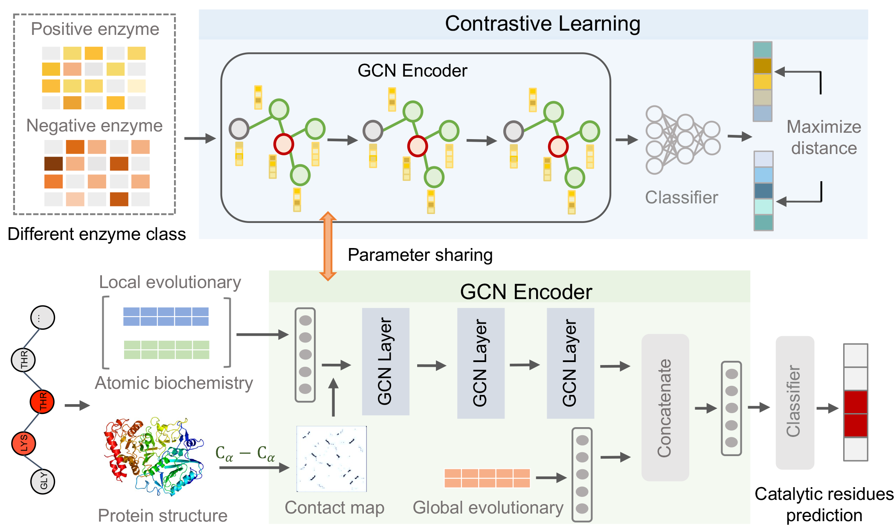
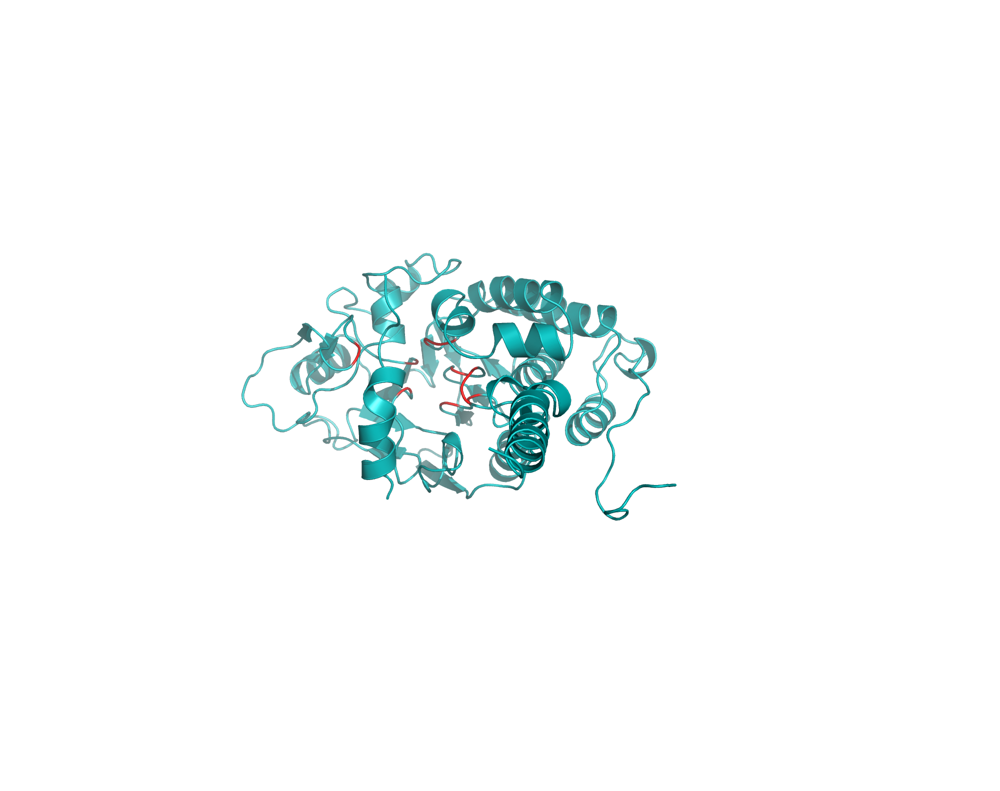

# Structure-guided prediction of catalytic residues in enzymes by deep learning
## Background

We introduced SCREEN (Structure-based Catalytic Residue Recognition in Enzymes) for precise and high-throughput prediction of catalytic residues across a wide range of taxonomic enzyme groups. This framework integrates heterogeneous data sources regarding enzyme structures, functions and evolutionary profiles.




## Installation
SCREEN is implemented using Python 3.6.13 and various scientific computing packages (numpy, biopython, scikit-learn, torch). We recommend creating a dedicated virtual environment and installing the same package versions, see the full list in requirements.txt.
Command lines that can be helpful in setting up the environment (tested on linux with python 3.6), this can be done in few lines using Anaconda (https://www.anaconda.com).

```
conda create --name SCREEN_env python=3.6
conda activate SCREEN_env
conda install pytorch==1.7.0 torchvision==0.4.0 torchaudio==0.7.0 -c pytorch 
pip install -r requirements.txt
```
 
No other external software is necessary to run SCREEN.


## Predicting catalytic residues using evolutionary information

The script for predicting catalytic residues with experimentally determined enzyme structure is predict.py, see some examples:

```
python predict_SCREEN.py --PDBfile ./Example/PDB_id.txt
```

The first argument is:
- A .txt file containing PDB ID (e.g. Example/PDB_id.txt); 

This file can contain multiple PDB_ids. A specific chain or list of chain can be added to the ID with an underscore (e.g. 1brs_A, 2p6b_B). 


## Visualizing the outputs
Here we provide an example of outputs obtained by predicting catalytic residues on the 1aui_A protein

- A Visualization/1aui-A.py script for visualizing the results with Pymol.
- The PDB file with catalytic residue probabilities inserted in the B-factor field

Below is a visualization of predicrted outputs for 1aui_A protein. 



## Retraining SCREEN
Catalytic residue data sets are provided in the Dataset/training_data folder, which included:
- the PDB_ids used for training in text format (training_id_withEC.txt).
- the label files in text format (training_label.txt). 

### Training from scratch on the enzyme catalytic residue data set

This can be done via:

```
python train_SCREEN.py
```

The main stages of train.py are:
1. Parsing the enzyme catalytic residue label files
2. Loading the extracted features of enzymes
2. Training of the network 
3. Prediction on the validation sets.

### Testing on five test data sets

This can be done via:
```
python test_SCREEN.py
```

##  features extraction pipline
To extract the handcrafted enzyme features, please use:

```
python feature_extract.py
```
The main stages of enzyme feature extraction are:
1. Writing the enzyme sequence fasta file 
2. Downloading the pdb files 
3. Preprocessing of the pdb files
4. Contact map construction according to the residue 3D coordination
5. MSA construction and PWM calculation 
6. Atom feature extraction
7. Protein residual level embedding using language model ProtT5 

Note that PSIBLAST and HHM must be installed and appropriately linked. Paths to the PSIBLAST and HHBLITS are defined in feature_extract.py


## Contact
For any question and comment regarding the code, please reach out to
tong.pan@monash.edu


